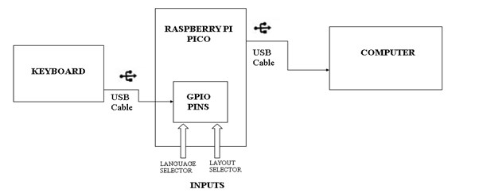

# `brahmi-keyboard-pico` : A hardware approach for typing in Brahmi based scripts.

A hardware approach for typing in Brahmi based scripts (languages) without installing any softwares on your computer, using Raspberry Pi Pico.  
Brahmi based scripts are _abugida_ scripts that combine consonant and vowel sound into single character. Kannada, Telugu, Devanagari, etc. all belong to this category.  
This is a guide to build the firmware and customise layouts for the keyboard device.
Default Layout correctly supports Kannada, Telugu and Devanagari.

## Building the firmware

### Windows

Make sure you have C compiler toolchain (MinGW or MSVC toolchain) and Git installed

  1. Install Raspberry Pi [Pico SDK](https://www.raspberrypi.com/news/raspberry-pi-pico-windows-installer/) or directly download [here](https://github.com/raspberrypi/pico-setup-windows/releases/latest/download/pico-setup-windows-x64-standalone.exe) (if you didn't install it in default location set environment variable PICO\_SDK\_PATH to location where you have installed it)

  2. Clone this repository in a desired directory.  
`git clone https://github.com/vinaykumar1ath/brahmi-keyboard-pico`

  3. Go to that directory and Run the script.  
```powershell
cd brahmi-keyboard-pico
./windows.ps1
```

### Debian based OS (*Raspberry Pi OS* or *Ubuntu*)

1. Clone this repository in a desired directory.  
    `git clone https://github.com/vinaykumar1ath/brahmi-keyboard-pico`

2. Install `jq` for parsing JSON data.  
    `sudo apt install jq`

3. Go to that directory and Run the script.  
```bash
cd brahmi-keyboard-pico
 sudo chmod +x ./debian.sh
./debian.sh
```

## Customising the layout

`layout_config.json` is where you customise the layout.
  
  * See sample `layout_config.json` to understand format.

  * This project supports 5 types of *keypress events*:
    1. single key (pressing and releasing one key) (`EMPTY-key` in `layout_config.json`).  
    2. double keypress (pressing two keys simultaneously i,e pressing a key while holding another key) (`VARGIYAvyanjana` in `layout_config.json`).  
    3. SHIFT+key (pressing key while holding SHIFT) (`SHIFT-key` in `layout_config.json`).  
    4. ALT+key (pressing key while holding ALT) (`ALT-key` in `layout_config.json`).  
    5. CTRL+key (pressing key while holding CTRL) (`CTRL-key` in `layout_config.json`).  
  
  * brahmi character type definitions:
    1. svara - vowels
    2. kagunita - vowel marks
    3. yogavaha - am ah
    4. vargiya vyanjana - 25 grouped consonants
    5. avargiya vyanjana - ungrouped consonants
    6. sankya - numbers

  * You can define upto 6 layouts in the `layout_config.json`.
  * Each layout has layout number and layout id (layout number can range from 1 to 6 as in "Layout1" "Layout2" and id can be any name to the layout).
  * Double keys are only configured to produce vargiya vyanjana,turn on or off double key feature by setting `enableVARGIYAdoubleKey` to true or false.  
      It is configured to preduce 25 characters by 10 keys.  
      In 5*5 vargiya vyanjana matrix one key selects row and another key selects column.  
      set `varga` to array of 5 row keys and set `prana` to array of 5 column keys in `VARGIYAvyanjana`.
  * In `EMPTY-key`, `SHIFT-key`, `ALT-key` and `CTRL-key`:  
      `intervals` refers to number of intervals in keyboard scancodes where keys are defined. and `ranges` are those intervals.  
      In `keys` layout is defined in format `"SCANCODE":"CHARACTER_NAME"`.

## Circuit guide 
 
   
   
Connect Pico to keyboard:  
     1. Connect VBUS (pin 40) to the USB +5V.  
     2. Connect GP0 (pin 1) to USB +D.  
     3. Connect GP1 (pin 2) to USB -D.  
     4. Connect GND (pin 3) to USB GND.  

Layout Selector:
* Take a female to female jumper wire, Connect from GND (pin 13) to GP10(pin 14) for Layout1, GP11(pin 15) for Layout2, and so on upto GP15(pin 20) for Layout6, except pin 18 it is GND pin.  

Language Selector:
 * Take a female to female jumper wire, Connect from GND (pin 28) to,  
   1. GP16(pin 21) for Kannada
   2. GP17(pin 22) for Telugu
   3. GP18(pin 24) for Devanagari
   4. GP19(pin 25) for Malayalam
   5. GP20(pin 26) for Tamil
   6. GP21(pin 27) for Bangla

* Connect GND (pin 33) to GP28 (pin 34) for input in linux.

This should be the connection:  

   
* Go to `build` folder and flash the firmware `BRAHMI_KEYBOARD.uf2` to the Pico. Click [here](https://www.youtube.com/watch?v=os4mv_8jWfU) for guide. 